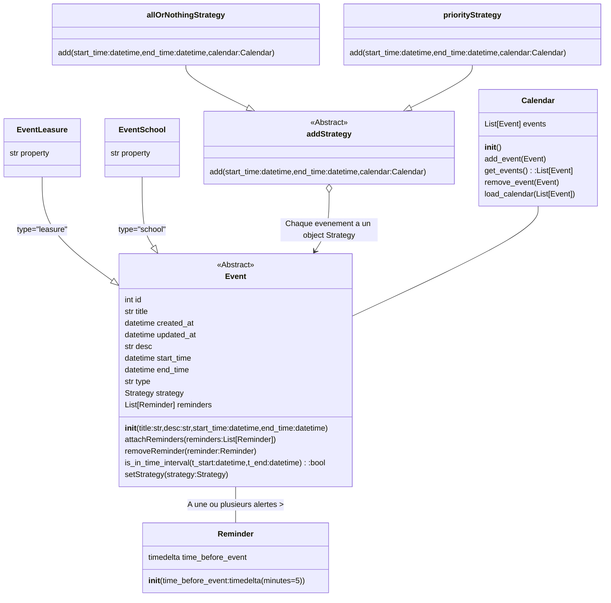
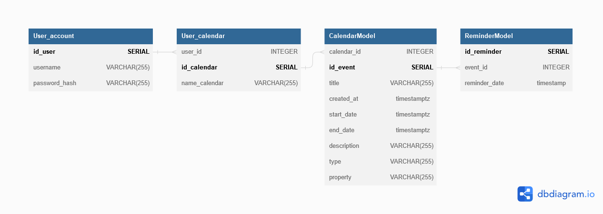
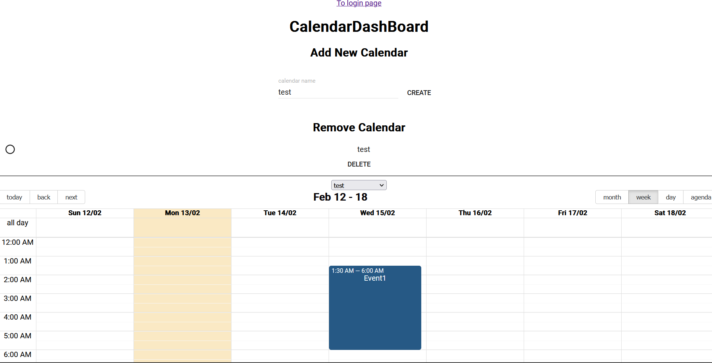

# :round_pushpin: Calendar application
**By Adrien Marquer and Jean-Alain MOREL**

A simple calendar application that allows users to view, add, and edit events.

## Features

- View events in a monthly or weekly format
- Add new events with a title, date, start time, and end time
- Edit or delete existing events
- handle multiple calendars

You can add 2 kinds of event :
- School event that have priority over other events.
- Leasure event that aren't priority events.


## Tech Stack :

This calendar app is built using the following technologies:

- React for front-end development
- Python FastAPI for back-end development
- PostgreSQL for storing events, calendars and  users

:warning: Reminder feature is on the way. Not available with the API or with the frontend for the moment.

## Table of contents
 
 1. [Requirements](#requirements)
 2. [Installation](#install)
 3. [Backend](#backend)
 4. [PostGreSQL](#postgresql)
 5. [FrontEnd](#frontend)
 6. [CI/CD](#cicd)
 7. [Azure deployment](#azure)
***


<div id='requirements'/>  


# Requirements :

 ```
sudo apt  install git
sudo apt  install docker.io
sudo apt  install docker-compose
sudo apt install curl
sudo apt  install terraform
snap install terraform --classic
 ```
***

<div id='install'/>  

# :rocket: Installation

Install with docker : Use of `docker-compose.yml` or control each container separately using `*.sh` files

1. Clone repository
```
git clone https://github.com/Jay-boo/calendar-app.git
```

2. Write your configuration in `.env`
```
cd calendar-app
```
Example of a `.env` file :
```
POSTGRES_USER=postgres
POSTGRES_PASSWORD=azerty
```


3.launch the `docker-compose.yml`

```
docker-compose up --build 
```

Or you can launch the 3 containers separately `*.sh` files.

4.Open `localhost:3000` in your browser to access frontend or `localhost:80` to access API

You can use `*.sh` files to manage stuff :
+ `build.sh` : to build the images if you don't want to use the docker-compose
+ `run.sh` : to excecute all your containers for the first time (eq to `docker build`)
+ `start.sh` : start all the containers 
+ `build_run_start.sh` : execute the 3 previous script 1in one time
+ `stop.sh` : stop all the containers
+ `remove.sh` : remove all the containers
+ `terraform_init.sh` : To init the terraform connection (see in [Azure deployment](#azure))
+ `start_AppServices.sh` : To start the App Services on Azure using terraform (see in [Azure deployment](#azure))
+ `stop_AppServices.sh` : To stop the App Services on Azure using terraform (see in [Azure deployment](#azure))

You can also find the images stored on azure (to pull and run):
+ `projetcalendar.azurecr.io/postgres`
+ `projetcalendar.azurecr.io/api`
+ `projetcalendar.azurecr.io/front`


<div id='backend'/>  

***
# BackEnd : FastAPI and POO

## POO
POO directory[`app/POO`](`app/POO/`)
Use of strategy design pattern to attach 2 differents strategies to event. 2 strategies have been implemented. Each of them define the policy when a event is added to a calendar
- [`allOrNothingStrategy`](app/POO/allOrNothingStrategy.py) :  If another calendar 's event occurs the wanted time interval, the event willnot be added 
- [`priorityStrategy`](app/POO/priorityStrategy.py) : Don't mind if there is already an event scheduled at the event time interval , an event with this strategy will be added to the wanted calendar





## FastAPI

You can find the different endpoints in  the [`app/routes` directory](app/routes)

:lock: means that you need to be authenticated to use this endpoint. It's not a real argument to pass in the 
request it's handle by localStorage in browser.

List of differents endpoint and there use:

Request| EndPoint | Args| Description |
| --- | --- | --- |--- |
|  `GET` | / |   ||
|  `POST` | /user |  username,password |Create User |
|  `POST` | /token |  username,password  |Generate User token |
|  `GET` | /user/me |  :lock: |Return username and the hashed password|
|`PUT` | /user | password, :lock: |Modify password of the active user |
|  `DELETE` | /user | password, :lock: |Delete User |
|  `POST` | /calendar/{name_calendar} |  name_calendar , :lock: |Create calendart with calendar name |
|  `GET` | /calendar |  :lock: |Return the calendars of the active user |
|  `GET` | /calendar/{calendar_id} |  calendar_id,:lock: |Return the events of the calendar targeted by calendar_id|
|  `DELETE` | /calendar/{calendar_id} | calendar_id, :lock: |Delete one of the calendar of the active user |
|  `POST` | /calendar/{calendar_id}/event |  calendar_id,`event_form` , :lock: |Add event to the calendar targeted by calendar_id |
|  `DELETE` | /calendar/{calendar_id}/event/{event_id} |  calendar_id,event_id , :lock: |Delete an event of a calendar or the active user |
|  `PUT` | /calendar/{calendar_id}/event/{event_id} |  calendar_id,event_id,`event_form` , :lock: |Update an event in a calendar |

- `event_form` :
```
title: title,
description: description,
start_date: start_date,
end_date: end_date,
property: property,
type: type
```


<div id='postgresql'/>  

***
# PostgreSQL database

Database architecture :


<div id='frontend'/>  

***
# FrontEnd : React 

For the front end React.js has been used. 
The code of the react app in in [`calendar-frontend`](calendar-frontend)

You can find `config.js` and `client.js`that allows to connect to our API using [`axios`](https://axios-http.com/fr/docs/intro).
Then the application is construct by 2 main  React components : 

- `CalendarComponent`: Visualize a Calendar with events. Based on [`react-big-calendar`](https://www.npmjs.com/package/react-big-calendar)
- `CalendarDashBoard`: Visualize every calendar of the active user and handle add or remove calendar request. When a calendar selected on this component, its child component `CalendarComponent` is updated to vizualize the chosen calendar. 

Login are handle with the `Login.jsx` page using `client.js` to request API.When someone logged in its credential are stored in the localStorage of the user browser.
Each following request will be intercept to put the credential in the request header before sending the request to the API.


Moreover some external styled components have been used : [material-ui](https://mui.com/material-ui/)




***
<div id='cicd'/>  

# CI/CD
You can find every CI/CD files in [`.github/workflows/`](.github/workflows/)

- Test : test POO
- Docker compose : Test docker container network 
- Azure tag and push
   Our images are stored in an Azure container registers. To allow us to always have the latest version on Azure we push the images we create an CI who push thes images at each changes, We also had to provided some secrets on github to make this work (allow github to send the images to Azure)

***

<div id='azure'/>  

# Azure Deployements 

## VM

For the VM there is no terraform setup to start is so if you want to see you will have to send us an email. For the VM we simply clone the github and  start the `build_run_start.sh` (because due to another version  of linux docker-compose didn't work)

We use a VM provided by Azure to deploy our App its available on :
+ http://calendarapp.westeurope.cloudapp.azure.com:3000/ : frontend
+ http://calendarapp.westeurope.cloudapp.azure.com:80/ : API

## Azure App Services

You can managed the App serivces with 3 `*.sh`files :
+ `terraform_init.sh` : To init the terraform connection and import ressources (only execute 1 times)
+ `start_AppServices.sh` : To start the App Services on Azure using terraform 
+ `stop_AppServices.sh` : To stop the App Services on Azure using terraform 

Before usign the `terraform_init.sh` you will need to complete the `main.tf` file located in the `terraform` folder with the information provided by mail. When you are going to start the App services with `start_AppServices.sh`at the end of the script you will have to write `yes` in your terminal (this is also the case when you will stop the App services)

Our service are available with 2 Azure App Service, as the app service allow us to access only 1 port we had to create two distrinct app services.
To see the result you can use these link :
+ https://calendarfront.azurewebsites.net/ : To access to the frontend
+ https://calendarappli.azurewebsites.net/ : To access to the API

To create the App service of the API we used the docker-compose : 
```yml
version: '3'
services:
  calendar_postgres:
    container_name: calendar_postgres
    image: projetcalendar.azurecr.io/postgres
    ports:
      - "5432:5432"
    environment:
      POSTGRES_PASSWORD: azerty
      POSTGRES_USER: postgres
  calendar_api:
    restart: always
    container_name: calendar_api
    image: projetcalendar.azurecr.io/api
    ports:
      - "80:80"
    environment:
      POSTGRES_HOST: calendar_postgres
      POSTGRES_PORT: 5432
      POSTGRES_DB: calendar_app
      POSTGRES_PASSWORD: azerty
      POSTGRES_USER: postgres
    links:
      - calendar_postgres:calendar_postgres
    healthcheck:
        test: ["CMD", "curl", "-f", "https://calendarappli.azurewebsites.net"]
        interval: 10s
        timeout: 2s
        retries: 5
```

To create the App service of the front we used the docker-compose : 
```yml 
version: '3'
services:
  calendar_front:
    container_name: calendar_front
    image: projetcalendar.azurecr.io/front
    ports:
      - "443:3000"
    environment:
      REACT_APP_API_PORT: 80
      REACT_APP_API_HOST: https://calendarappli.azurewebsites.net
```

